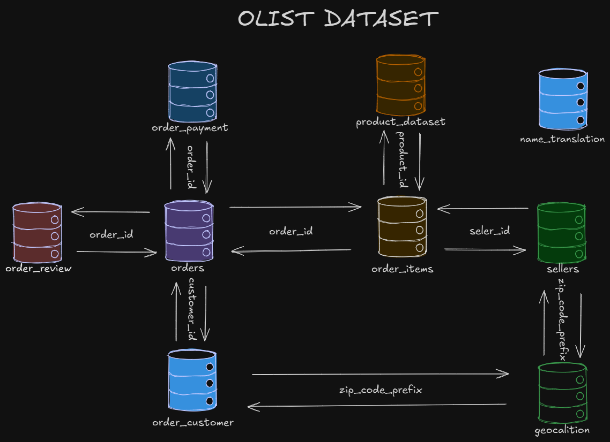

# Airflow MySQL ↔ BigQuery Pipelines

Este repositório contém pipelines desenvolvidos em **Apache Airflow** para **extrair, transformar e carregar (ETL)** dados entre **MySQL** e **Google BigQuery**.  
Os fluxos permitem tanto a transferência de dados do MySQL para o BigQuery quanto o caminho inverso, garantindo maior controle e automação no processo.

---

## 🚀 Objetivo

Substituir processos manuais ou scripts isolados de integração de dados por pipelines orquestrados com o **Airflow**, oferecendo:  
- 🔄 Flexibilidade e personalização.  
- 📈 Escalabilidade e monitoramento.  
- 🛠️ Facilidade de manutenção e versionamento.  

---

## ⚙️ Funcionalidades

- Extração de dados a partir do **MySQL**.  
- Carregamento de dados no **BigQuery** (e vice-versa).  
- Transformações leves e personalizadas em Python.  
- Execuções agendadas e automáticas via Airflow.  
- Monitoramento centralizado com logs detalhados pela **UI do Airflow**.  

---

## 📂 Pipelines Disponíveis

- **`bigquery_to_mysql_only`** → Carrega dados crus do BigQuery para o MySQL.  
- **`list_bigquery_tables_dag`** → Lista todas as tabelas do dataset `DataLake` no BigQuery.  
- **`mysql_to_bigquery_only`** → Carrega dados crus do MySQL para o BigQuery.  
- **`test_env_vars_dag`** → Valida se as variáveis de ambiente configuradas no `.env` estão corretas dentro da conteinerização (Docker), garantindo conexões consistentes com diferentes bancos de dados.  
- **`medallion_struct`** → Uma pipeline que segue a **Medallion Architecture** (Bronze → Silver → Gold), garantindo melhor governança e qualidade dos dados. Esse fluxo foi projetado para lidar tanto com processos upstream quanto downstream, permitindo integração com diferentes sistemas.
---

## 🗂️ Estrutura de Dados Utilizada

- **OLIST**  


---

## 🛠️ Tecnologias e Ferramentas

- [Apache Airflow](https://airflow.apache.org/)  
- [Google Cloud BigQuery](https://cloud.google.com/bigquery)  
- [MySQL](https://www.mysql.com/)  
- [Google Cloud SDK](https://cloud.google.com/sdk) – autenticação e acesso aos serviços GCP  

---

## 🏗️ Como Rodar o Projeto

1. **Clone o repositório**  
   ```bash
   git clone https://github.com/renan-lemes/pipelines-Airflow
   cd pipelines-Airflow
   ```

2. **Crie e configure o arquivo `.env`** com as credenciais necessárias (MySQL, BigQuery e variáveis do Airflow):  
   ```env
   MYSQL_HOST=localhost
   MYSQL_PORT=3306
   MYSQL_USER=root
   MYSQL_PASSWORD=senha
   MYSQL_DATABASE=meu_banco

   GOOGLE_PROJECT_ID=meu-projeto
   GOOGLE_DATASET_ID=DataLake
   GOOGLE_APPLICATION_CREDENTIALS=/opt/airflow/dags/key.json
   ```

3. **Suba os containers do Airflow com Docker Compose**  
   ```bash
   docker-compose up -d
   ```

4. **Acesse o Airflow UI** em [http://localhost:8080](http://localhost:8080).  
   - Usuário padrão: `airflow`  
   - Senha padrão: `airflow`  

5. **Configure as conexões no Airflow UI** (Admin → Connections):  
   - **MySQL** → `mysql_default`  
   - **BigQuery** → `google_cloud_default`  

6. **Ative a DAG desejada** na interface do Airflow e monitore a execução.  

---

## 📌 Observações
  
- É recomendável manter logs de execução (quantidade de registros carregados, timestamp da atualização) para monitoramento da qualidade dos dados.  
