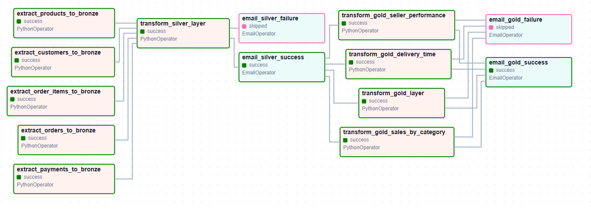
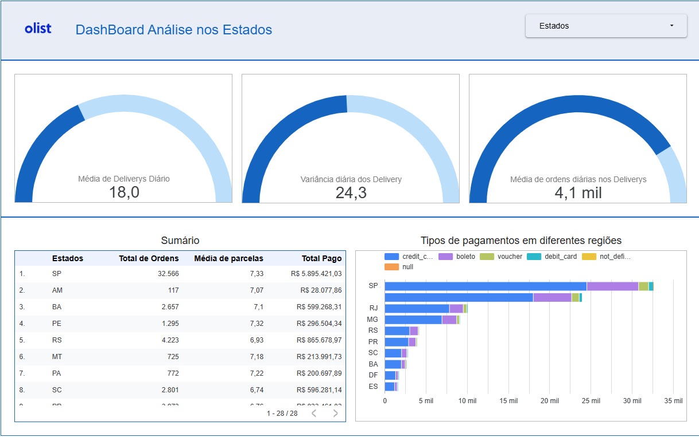

# 🌬️ Airflow MySQL ↔ BigQuery ou BigQuery ↔ MySQL Pipelines

Este repositório contém pipelines desenvolvidos em **Apache Airflow** para **extrair, transformar e carregar (ETL)** dados entre **MySQL** e **Google BigQuery**.  
Os fluxos permitem tanto a transferência de dados do MySQL para o BigQuery quanto o caminho inverso, garantindo **automação, escalabilidade e controle** em todo o processo e focando principalmente na orquestração de dados.

---

## 🎯 Objetivo

Substituir processos manuais ou scripts isolados por **pipelines orquestrados** com o Airflow, oferecendo:

- 🔄 **Automação e flexibilidade** no agendamento e controle de fluxos.  
- 📈 **Escalabilidade e monitoramento** centralizado.  
- 🛠️ **Facilidade de manutenção, reuso e versionamento**.  

---

## ⚙️ Funcionalidades Principais

- Extração de dados a partir do **MySQL**.  
- Carga de dados no **BigQuery** (e vice-versa).  
- Transformações leves em **Python**.  
- Execuções **agendadas e automáticas** via Airflow.  
- Monitoramento detalhado via **Airflow UI**.  
- **Envio automático de e-mails (Gmail)** em caso de falhas nas pipelines.  
- Preparado para **integração CI/CD**, permitindo versionamento e implantação contínua.  

---

## 🧩 Pipelines Disponíveis

| Pipeline | Descrição |
|-----------|------------|
| **`bigquery_to_mysql_only`** | Carrega dados crus do **BigQuery** para o **MySQL**. |
| **`list_bigquery_tables_dag`** | Lista todas as tabelas do dataset `DataLake` no BigQuery. |
| **`mysql_to_bigquery_only`** | Carrega dados crus do **MySQL** para o **BigQuery**. |
| **`test_env_vars_dag`** | Valida as variáveis de ambiente configuradas no `.env` dentro dos containers Docker, garantindo conexões consistentes. |
| **`medallion_struct`** | Pipeline baseada na **Medallion Architecture** (Bronze → Silver → Gold), garantindo governança, qualidade e integração entre processos upstream e downstream. |

---

## 🗂️ Estrutura de Dados Utilizada

**OLIST Dataset**  


---

## 🛠️ Tecnologias e Ferramentas

- [Apache Airflow](https://airflow.apache.org/)  
- [Google Cloud BigQuery](https://cloud.google.com/bigquery)  
- [MySQL](https://www.mysql.com/)  
- [Google Cloud SDK](https://cloud.google.com/sdk) – autenticação e acesso aos serviços GCP  
- [Gmail API](https://developers.google.com/gmail/api) – envio automático de notificações em caso de erro nas pipelines  
- [Docker & Docker Compose](https://www.docker.com/) – conteinerização dos serviços  
- [Git & GitHub](https://github.com/) – controle de versão  

---

## 🏗️ Como Executar o Projeto

1. **Clone o repositório**  
   ```bash
   git clone https://github.com/renan-lemes/pipelines-Airflow
   cd pipelines-Airflow
   ```

2. **Configure o arquivo `.env`** com as credenciais e variáveis necessárias:  
   ```env
   MYSQL_HOST=localhost
   MYSQL_PORT=3306
   MYSQL_USER=root
   MYSQL_PASSWORD=senha
   MYSQL_DATABASE=meu_banco

   GOOGLE_PROJECT_ID=meu-projeto
   GOOGLE_DATASET_ID=DataLake
   GOOGLE_APPLICATION_CREDENTIALS=/opt/airflow/dags/key.json

   EMAIL_SENDER=my_email@gmail.com
   EMAIL_PASSWORD=my_gmail_app_password
   EMAIL_RECEIVER=team@datateam.com
   ```

3. **Suba os containers com o Docker Compose**  
   ```bash
   docker-compose up -d
   ```

4. **Acesse o Airflow UI:** [http://localhost:8080](http://localhost:8080)  
   - Usuário padrão: `airflow`  
   - Senha padrão: `airflow`  

5. **Configure as conexões** no Airflow (Admin → Connections):  
   - **MySQL:** `mysql_default`  
   - **BigQuery:** `google_cloud_default`  
   - **Email:** `smtp_default` (para envio de alertas)  

6. **Ative a DAG desejada** na interface do Airflow e monitore sua execução.  

---

## 📧 Alertas Automáticos de Erros

O Airflow foi configurado para **enviar e-mails automáticos via Gmail** quando uma DAG falhar.  
O alerta inclui:
- Nome da DAG e da task com erro  
- Horário da falha  
- Log resumido da execução  

Isso permite **resposta rápida** e acompanhamento proativo de falhas em produção.

---

## 📋 Boas Práticas e Observações

- Mantenha logs de execução (quantidade de registros, timestamps, status) para acompanhamento da **qualidade e integridade dos dados**.  
- Utilize o **scheduler do Airflow** para orquestrar rotinas periódicas.  
- Cada pipeline pode ser ajustada para ambientes **dev**, **staging** e **prod** apenas alterando variáveis de ambiente.  
- Recomendado integrar com **GitHub Actions** para CI/CD, garantindo que atualizações de DAGs sejam testadas e implantadas automaticamente.  

---

---

## 🧱 Arquitetura Medallion

A pipeline **`medallion_struct`** segue o modelo de camadas **Bronze**, **Silver** e **Gold**:

- **Bronze:** dados crus extraídos dos dados, sem transformações.  
- **Silver:** dados tratados e padronizados (ajuste de colunas, formatação de tipos e validações).  
- **Gold:** dados agregados e prontos para visualização no dashboard.

📊 **Representação Visual da Arquitetura:**
💡 Exemplo de execução no Airflow UI (DAG Medallion):


---

## 📊 Dashboard com Dados Gold – Looker Studio

Após o processamento dos dados nas camadas *Bronze*, *Silver* e *Gold*, foi criado um **dashboard no Looker Studio** para análise e visualização dos dados refinados.  



🔗 **Acesse o Dashboard:**  
[https://lookerstudio.google.com/u/0/reporting/a3eccf51-1a31-44b7-9e57-9faac8efced6/page/iURdF](https://lookerstudio.google.com/u/0/reporting/a3eccf51-1a31-44b7-9e57-9faac8efced6/page/iURdF)
 